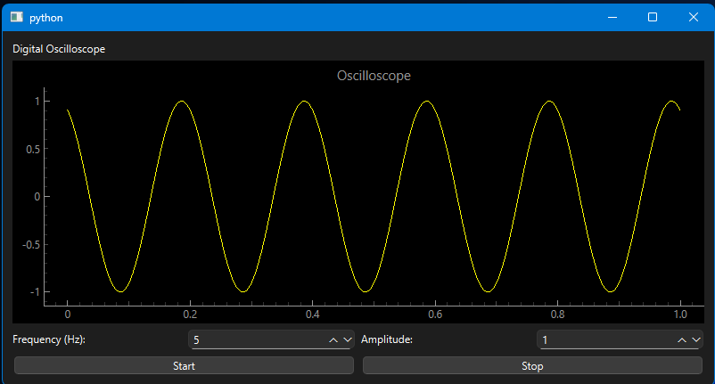
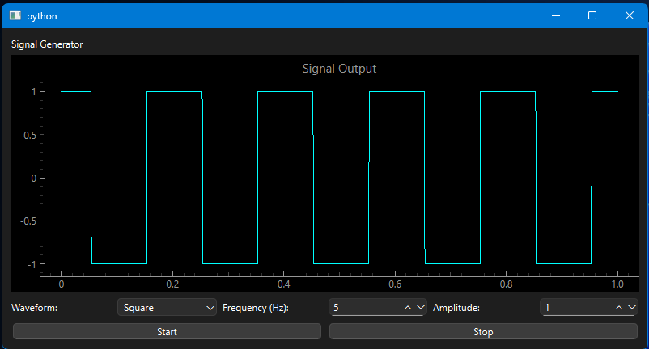
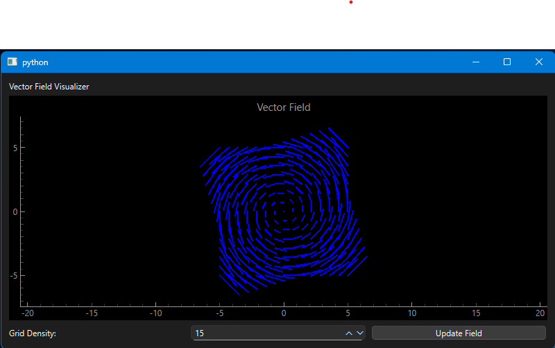
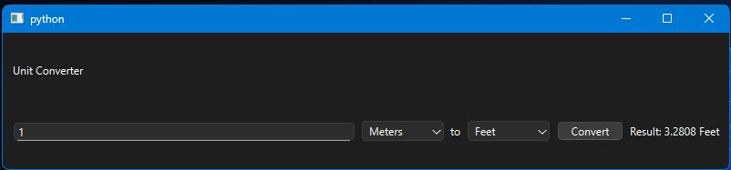
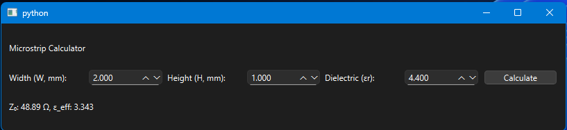
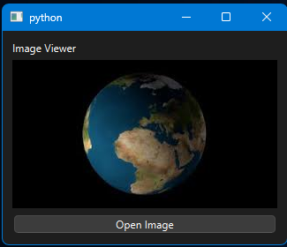
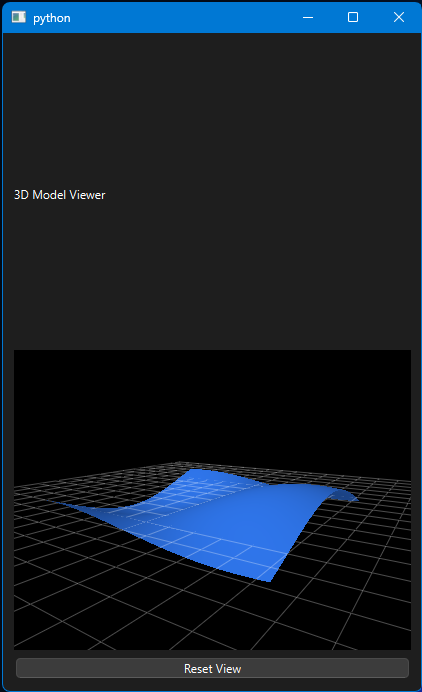

# EngineeringWidgets
A collection of small engineeing apps written in Python and PyQt6

Libraries:
- PyQt6
- pyqtgraph
- pyopengl
- numpy

## Digital Oscilloscope

## Signal Generator

## Vector Field Visualizer

## Units Converter

## Microstrip Calculator

## Image Viewer

## 3D Model Viewer

